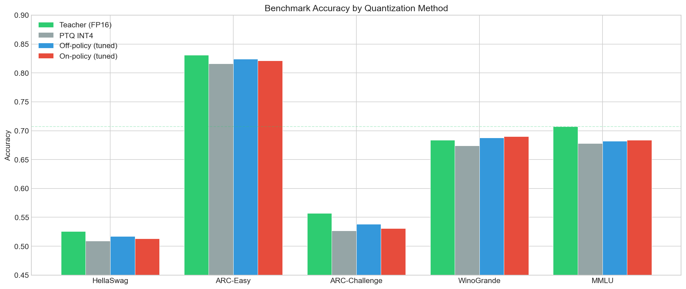
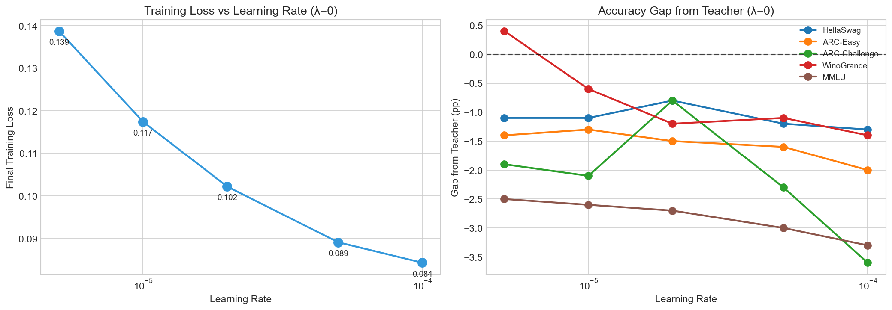
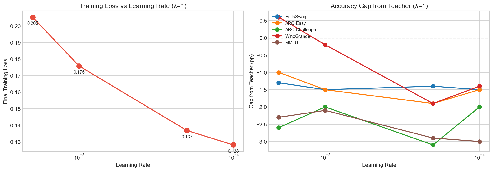

# On-Policy Quantization

Knowledge distillation from FP32 teacher to INT4 student using on-policy (student-generated) data rather than static datasets.

Standard KD trains on fixed datasets, causing distribution mismatch—the student never learns from its own mistakes. On-policy distillation fixes this by having the student generate sequences and learning from teacher feedback on those generations. Inspired by [GKD](https://arxiv.org/abs/2306.13649) and [on-policy distillation](https://thinkingmachines.ai/blog/on-policy-distillation/).

## TL;DR: Null result

> On-policy distillation doesn't provide significant benefits over off-policy, even after hyperparameter tuning. Best-tuned λ=0 and λ=1 perform within 0.3% of each other.

- Distribution mismatch is probably not a big issue when student and teacher share the same weights at different precision
- On-policy rollouts are much more compute intensive than simple off-policy SFT
- One interesting finding: optimal β differs by regime (forward KL for off-policy, reverse KL for on-policy)

## Setup

```bash
uv sync
```

## Training

```bash
# Off-policy KD (λ=0, β=0, lr=5e-6) - best tuned
uv run accelerate launch train.py @configs/offpolicy.toml --output-dir dump/offpolicy --quant-type int4

# On-policy KD (λ=1, β=1, lr=5e-6) - best tuned
uv run accelerate launch train.py @configs/onpolicy.toml --output-dir dump/onpolicy --quant-type int4
```

## Results

`λ` controls data source interpolation:

- `λ=0`: Off-policy (dataset sequences only)
- `λ=1`: Fully on-policy (student-generated sequences only)

### On-Policy (λ=1) vs Off-Policy (λ=0)



Distillation recovers most of the accuracy lost by naive PTQ INT4, but on-policy (λ=1) and off-policy (λ=0) perform equivalently. The ~0.5% differences between them are within noise.

### Best Tuned Configurations

| Config | λ | Settings | HellaSwag | ARC-E | ARC-C | WinoGr | MMLU | Avg |
|--------|---|----------|-----------|-------|-------|--------|------|-----|
| Teacher (FP16) | - | - | 0.526 | 0.831 | 0.557 | 0.684 | 0.707 | 0.661 |
| Off-policy | 0 | lr=5e-6, β=0 | 0.517 | 0.824 | 0.538 | 0.688 | 0.682 | 0.650 |
| Mixed | 0.5 | β=0 | 0.517 | 0.821 | 0.538 | 0.675 | 0.682 | 0.647 |
| On-policy | 1 | lr=5e-6, β=1 | 0.513 | 0.821 | 0.531 | 0.690 | 0.684 | 0.648 |

All within ~0.3% of each other—confirms null result. Note: optimal β differs by regime (forward KL for off-policy, reverse KL for on-policy).

### Learning Rate Sweep (λ=0, off-policy)



Higher learning rates achieve lower training loss but worse eval accuracy. Lower LRs (5e-6, 1e-5) generalize better despite not fitting the training data as tightly.

### Learning Rate Sweep (λ=1, on-policy)



Same pattern as off-policy: lower LRs (5e-6, 1e-5) generalize better despite higher training loss.

### Extended Training (λ=0, 1k vs 20k steps)

| Steps | Train Loss | HellaSwag | ARC-Easy  | ARC-Challenge | WinoGrande | MMLU      |
| ----- | ---------- | --------- | --------- | ------------- | ---------- | --------- |
| 1k    | 0.118      | 0.514     | 0.815     | 0.534         | **0.673**  | **0.677** |
| 20k   | 0.068      | 0.513     | **0.820** | **0.546**     | 0.664      | 0.674     |

20x compute reduces training loss by 42% but eval accuracy is mixed. Suggests we've hit the accuracy ceiling for INT4 quantization.

### Beta sweep (λ=0)

- `beta=0`: forward KL
- `beta=1`: reverse KL
- `beta` between 0-1 interpolates between the two.

For standard distillation, forward KL is often used, however [on policy distillation](https://thinkingmachines.ai/blog/on-policy-distillation/#loss-function-reverse-kl) recommends reverse KL. I find similar results for λ=0 (off-policy distillation) forward KL performs better.

| Beta | HellaSwag | ARC-Easy  | ARC-Challenge | WinoGrande | MMLU  |
| ---- | --------- | --------- | ------------- | ---------- | ----- |
| 0.0  | **0.521** | **0.823** | **0.540**     | 0.678      | 0.681 |
| 0.5  | 0.517     | 0.822     | 0.537         | 0.679      | 0.681 |
| 1.0  | 0.515     | 0.820     | 0.538         | **0.684**  | 0.679 |

### On-Policy Hyperparameter Sweeps (λ=1)

#### Beta

| Beta | HellaSwag | ARC-Easy | ARC-Challenge | WinoGrande | MMLU  |
| ---- | --------- | -------- | ------------- | ---------- | ----- |
| 0.5  | **0.515** | 0.819    | **0.538**     | 0.675      | 0.686 |
| 1.0  | 0.512     | 0.819    | 0.533         | **0.676**  | **0.686** |

Results are close, but β=1 (reverse KL) is theoretically motivated for on-policy—the student should mode-seek rather than mean-seek when learning from its own generations. This aligns with [on-policy distillation](https://thinkingmachines.ai/blog/on-policy-distillation/#loss-function-reverse-kl) recommendations.

Interestingly, optimal β differs by training regime:
- **Off-policy (λ=0)**: Forward KL (β=0) works best
- **On-policy (λ=1)**: Reverse KL (β=1) works best

This makes theoretical sense: off-policy trains on fixed data (mean-seeking appropriate), while on-policy trains on student generations (mode-seeking appropriate).

#### Increasing compute

From limited sweeps, it seems that batch size and rollout length are not sensitive params.

> Note I do the same number of steps, so doubling batch size / rollout lenght doubles the compute budget! Suggesting we've saturated the quantization accuracy of the model.

##### Batch size

| Batch Size | HellaSwag | ARC-Easy  | ARC-Challenge | WinoGrande | MMLU      |
| ---------- | --------- | --------- | ------------- | ---------- | --------- |
| 16         | 0.513     | 0.817     | **0.543**     | 0.673      | **0.685** |
| 32         | 0.512     | **0.822** | 0.540         | 0.671      | 0.684     |

##### Rollout length

| Tokens | HellaSwag | ARC-Easy  | ARC-Challenge | WinoGrande | MMLU      |
| ------ | --------- | --------- | ------------- | ---------- | --------- |
| 128    | 0.512     | **0.819** | 0.533         | 0.676      | **0.686** |
| 256    | 0.513     | 0.818     | 0.530         | **0.681**  | 0.682     |
| 512    | **0.514** | 0.815     | **0.536**     | 0.676      | 0.685     |

### Mixed On/Off-Policy (λ=0.5)

Interpolating between on-policy and off-policy data sources.

| Config | HellaSwag | ARC-Easy | ARC-Challenge | WinoGrande | MMLU  |
|--------|-----------|----------|---------------|------------|-------|
| λ=0.5, β=1 (default) | 0.516 | 0.819 | 0.533 | 0.680 | 0.686 |
| λ=0.5, β=0 | 0.517 | 0.821 | 0.538 | 0.675 | 0.682 |

Mixed strategy performs similarly to both extremes—no benefit from interpolation.
